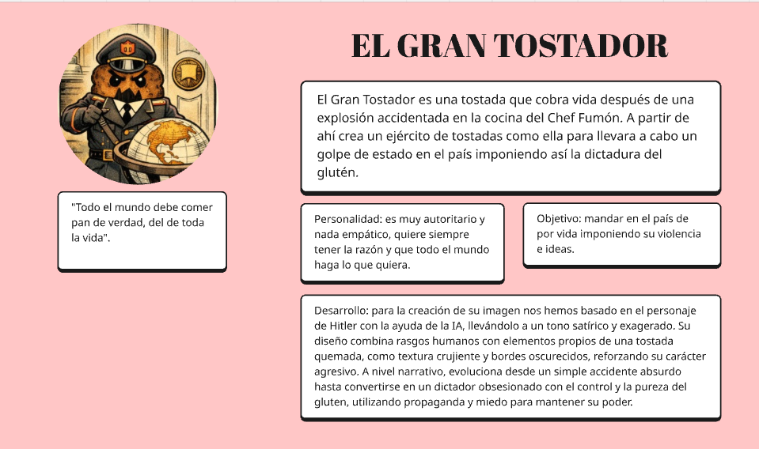
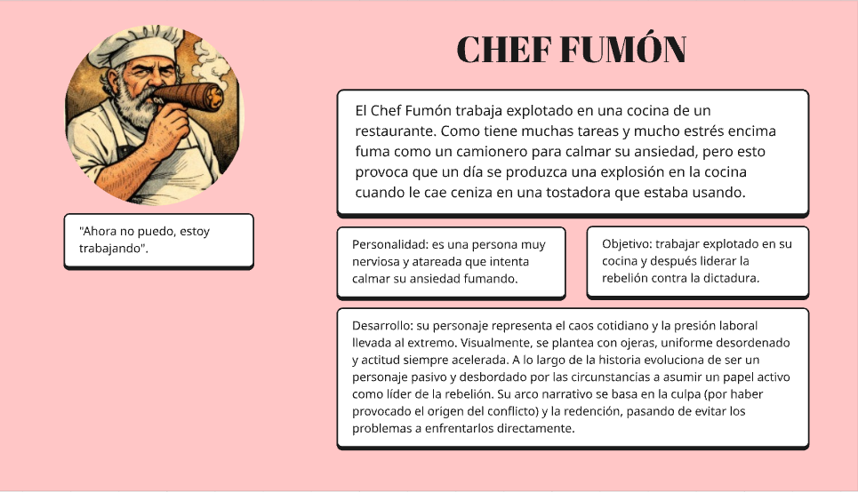
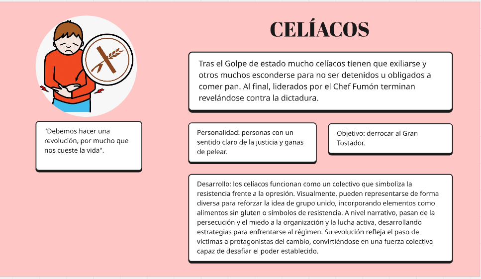
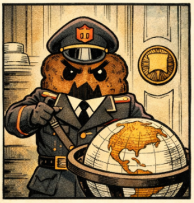
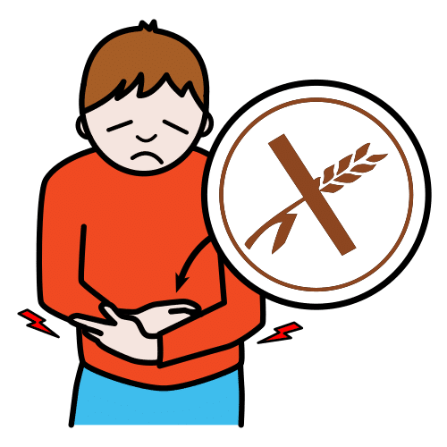
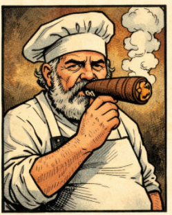

# TOSTADA FASCISTA: 
### my_storytelling
Plantilla para crear mi historia interactiva de la asignatura [Creatividad e innovación Audiovisual](https://www.ugr.es/estudiantes/grados/grado-comunicacion-audiovisual/creacion-difusion-nuevos-contenidos-audiovis), repositorio de proyectos y documentación en https://github.com/mgea/storytelling

Autores:  
<!---
Incluir lista de personas del grupo 
Se puede añadir enlace a página personal de github o lo que se quiera...(optativo)
-->

- :neckbeard: Eva Senra Fafián
- :bowtie: Eneko Sáez Manzanas
- :dancer: Naira González Comesaña
- :rage1: Sara Martín Yugueros
  

Proyecto (código): 
URL (link) del proyecto en Github: 

Tipo/Género:  
- [ ] FictionCiberpunk  
- [ ] Reality/tribus urbanas  
- [x] Comic

## Resumen
Un chef ocasiona una explosión con su cigarro y una tostadora creando una tostada maligna con vida que se convierte en un dictador fascista. Establece una dictadura y todos los celiacos quedan oprimidos hasta que deciden llevara a cabo una revolución.

### Personajes

### Historia
Todo comenzó en la cocina de un restaurante . El Chef Fumón, al borde de un colapso nervioso y rodeado de comandas, dejó caer accidentalmente una brasa de su cigarro dentro de una tostadora industrial. La combustión química entre la nicotina, el acero oxidado y una rebanada de pan de masa madre creó una anomalía molecular: El Gran Tostador.

Esta tostada no solo cobró vida, sino que nació con un complejo de superioridad carbonizado. En cuestión de horas, el gran tostador organizó y proclamó la "Dictadura del Trigo". Su primera ley fue clara: cualquier alimento sin gluten es una traición al sabor. Mientras el Chef Fumón intentaba apagar el incendio de su cocina, el país ya estaba siendo patrullado por un ejército de picatostes armados. Los Celíacos, ahora perseguidos como disidentes, han tenido que refugiarse en panaderías clandestinas de harina de maíz, esperando el momento exacto para que la resistencia gané.

### TagLine
"En un mundo de migas, solo el más tostado sobrevive. ¡Únete a la Gluten-Revolución!"

### Conflicto 
El conflicto central es una lucha por la supervivencia alimentaria y la libertad de elección, dividida en tres frentes:

Ideológico: La obsesión de El Gran Tostador por la "pureza del gluten" frente al derecho de los celíacos a existir sin ser intoxicados. Es una lucha entre el totalitarismo gastronómico y la diversidad dietética.

Moral (Redención): El Chef Fumón carga con la culpa de haber creado al monstruo. Su conflicto interno es pasar de un empleado sumiso y adicto al tabaco a un líder revolucionario que debe destruir su propia "creación" para salvar al pueblo.

El clímax se centra en derrocar al dictador antes de que logre "tostar" a toda la población.

### Productos

- Personajes:

  
    
  
    
  

  Enlace de test de personalidad: 
https://h5p.org/node/1558826 

- Banner/Teaser: 

- Storytelling: 

------

<!---
Lista completa de emojis de markDown - https://gist.github.com/rxaviers/7360908) 
-->

Febrero, 202X

Proyecto dentro de la serie [Narrativas interactivas](https://github.com/mgea/storytelling/blob/master/What_is_a_digital_storytelling.md) 
Proyectos seleccionados de [2023](https://github.com/mgea/storytelling/tree/master/2023), [2022](https://github.com/mgea/storytelling/blob/master/2022/readme.md) / [2021](https://github.com/mgea/storytelling/blob/master/2021/readme.md) / [2020](https://github.com/mgea/storytelling/blob/master/2020/readme.md)  / 
[2019](https://github.com/mgea/storytelling/blob/master/2019/readme.md) / [2018](https://github.com/mgea/storytelling/blob/master/2018/readme.md) 

CC BYNCSA [Creatividad e Innovación Audiovisual-B](https://github.com/mgea/criav/)

 

[Facultad de Comunicación y Documentación](http://fcd.ugr.es)

Universidad de Granada
